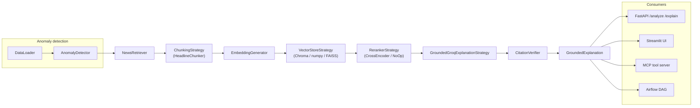

# Architecture

## RAG pipeline



`RAGRetriever` (`processors/rag_retriever.py`) composes chunking + embedding +
vector store + reranker into one retrieval call, with a bounded
adaptive-retry loop: if the best reranked score falls below
`min_relevance_score`, it widens the historical lookback window and
re-retrieves, capped at `max_retries`. `GroundedGroqExplanationStrategy`
(`processors/grounded_explainer.py`) prompts for inline `[S1]`-style
citations and structured JSON output, then `CitationVerifier`
deterministically substring-matches every cited quote against its source
chunk -- an explanation citing something not actually in the retrieved text
gets flagged, not silently trusted.

The original whole-event path (embed each event once, FAISS nearest-neighbor,
plain prompt) still exists (`config['use_rag'] = False`) so the two can be
A/B'd -- see `src/experiments/evaluate.py`.

## OOP design patterns

This started as an MA5750 (Object-Oriented Programming) course project, and
the pattern usage is structurally real, not decorative:

- **Strategy** -- every processor (`processors/*.py`) separates the
  interface from the algorithm: `DataLoadStrategy`, `AnomalyDetectionStrategy`,
  `NewsRetrievalStrategy`, `EmbeddingStrategy`, `SimilarityStrategy` (and its
  RAG-era subtype `VectorStoreStrategy`), `AIExplanationStrategy`,
  `ChunkingStrategy`, `RerankerStrategy`. Each processor class
  (`DataLoader`, `AnomalyDetector`, ...) holds a strategy instance and
  delegates to it, so swapping Z-score detection for Isolation Forest, or
  FAISS for Chroma, is a constructor argument, not a rewrite.
- **Factory** -- one factory per processor family (`NewsRetrieverFactory`,
  `EmbeddingGeneratorFactory`, `AIExplainerFactory`, `ChunkerFactory`,
  `VectorStoreFactory`, `RerankerFactory`) centralizes
  `create_x(service, **kwargs)` dispatch so callers don't need to know
  concrete strategy class names.
- **Builder** -- `PipelineBuilder` (`pipeline/pipeline_factory.py`) offers a
  fluent `.with_ticker(...).with_rag(...).build()` API for assembling a
  pipeline configuration incrementally, with `PipelineDirector` providing a
  few pre-configured recipes (`create_basic_pipeline`,
  `create_advanced_pipeline`, `create_streamlit_pipeline`) on top of it.
- **Template Method** -- `BaseAnalysisPipeline.run()`
  (`core/base.py`) fixes the `_preprocess` -> `_analyze` -> `_postprocess`
  sequence; `QuantitativeAnalysisPipeline` (`pipeline/quantitative_pipeline.py`)
  implements each step, including branching internally between
  `_analyze_rag` and `_analyze_legacy`.
- **Observer** -- `IProgressObserver` implementations
  (`ConsoleProgressObserver`, `StreamlitProgressObserver`,
  `MultiProgressObserver` in `pipeline/progress_observer.py`) get progress/
  error callbacks from every processor and the pipeline itself, decoupling
  "what happened" from "how it's displayed."
- **Repository** -- `BaseDataRepository` (`core/base.py`) abstracts
  persistence (`save_events`/`load_events`/`save_explanations`) behind an
  `IDataRepository` interface, backing both the pipeline's own result-saving
  and the Airflow DAG's inter-task state handoff.

## Directory layout

```
src/
├── core/           interfaces.py, base.py, exceptions.py -- the SOLID skeleton
├── processors/      Strategy classes: original (data_loader, anomaly_detector,
│                    news_retriever, embedding_generator, similarity_analyzer,
│                    ai_explainer) + RAG upgrade (chunking, vector_store,
│                    reranker, rag_retriever, grounded_explainer)
├── pipeline/        quantitative_pipeline.py (Template Method) ·
│                    pipeline_factory.py (Factory/Builder/Director) ·
│                    progress_observer.py (Observer)
├── ui/              Streamlit UI
├── config/          settings.py (pydantic-settings, env/.env, api_keys.txt fallback)
├── experiments/      eval_set.json · metrics.py · evaluate.py (dual-metric eval)
├── serving/         api.py (FastAPI) · schemas.py · dependencies.py ·
│                    mcp_server.py (MCP tool server)
├── main_oop.py      CLI entry point
└── app_oop.py       Streamlit entry point
tests/                pytest -- one file per Strategy family, offline/mocked
airflow/dags/         financial_anomaly_dag.py -- same Strategy classes, scheduled
.github/workflows/    CI: ruff + pytest + docker build
```
